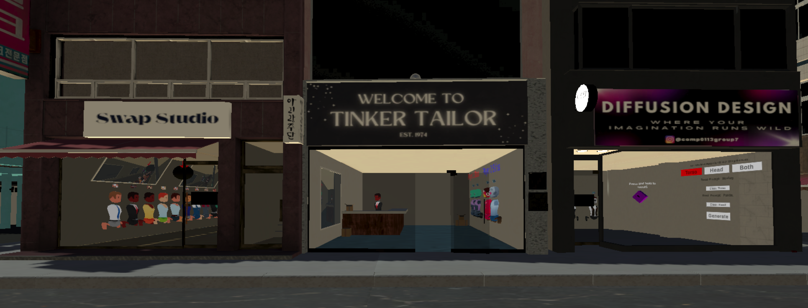
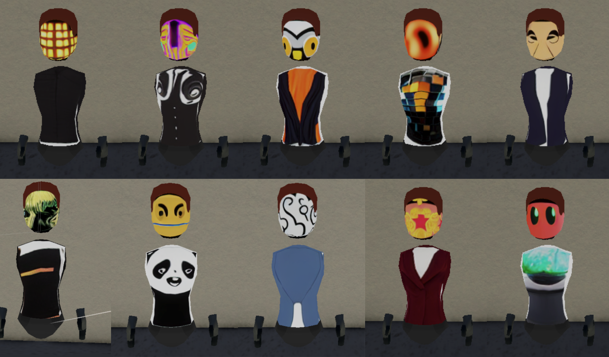

# Avatar Maker

A simple and fun project that allows you to collaborate and create customised avatars. This project leverages Unity alongside advanced diffusion techniques to offer a dynamic avatar creation experience.

## Table of Contents

- [Overview](#overview)
- [Installation](#installation)
- [Project Structure](#project-structure)
  - [Resources Folder Breakdown](#resources-folder-breakdown)
  - [Imported Assets](#imported-assets)
- [Usage](#usage)

## Overview

Avatar Maker is designed as a collaborative platform where users can create and customize avatars. With an intuitive interface and a comprehensive set of assets and scripts, the project supports both prefab-based development and advanced AI-driven diffusion techniques for skin generation and texture customization.

## Installation

Follow these steps to set up the project:

1. **Install Unity Editor:**  
   Open Unity Hub and install the following version of the Unity Editor:

    `6000.0.34f1`

2. **Clone the Repository:**  
    In your workspace, run:

    `git clone https://github.com/Tchowds/VEnv_GRP7_Avatar_Maker.git`

3. **Add the Project:**  
Open Unity Hub, click on `Add` → `Add Project From Disk`, and select the cloned repository.

4. **Configure for Meta Quest:**  
Open the project in Unity Editor and set all the necessary settings for building on Meta Quest devices. Refer to the project documentation for detailed steps on configuring these settings.

## Project Structure

The project is organized to streamline development and asset management.

### Main Components

- **Main Scene:**  
The primary scene is `BaseCity.unity`, located in the `Scenes` folder.

- **Assets Folder:**  
All working files and assets reside in the `Assets` folder. The most critical components are organized within the `Resources` subfolder.

### Resources Folder Breakdown

The `Resources` folder contains multiple subfolders, each dedicated to a specific aspect of the project:

- **Animated Objects:**  
Assets for animated elements (e.g., the curtain in Diffusion Designer shop and the bobbing arrow in Swap Studio).

- **Avatar Barriers:**  
A cut feature initially intended as an interactive challenge where matching textures would unlock doors. It was removed due to project vision changes and time constraints.

- **Avatar Mannequin:**  
Contains the Mannequin prefab and associated scripts that define its behavior.

- **Avatar Prefabs:**  
Includes the various avatar prefabs used throughout the scene along with the prefab catalogue available in the Ubiq Network scene.

- **Avatar Scripts:**  
A collection of scripts for avatar operations, including texture copying and specialized behaviors such as `FloatingAvatar` and `TexturedAvatar`.

- **Body:**  
Prefab objects and assets that form the head and hand structures, along with animations.

- **Diffusion:**  
Core scripts that manage diffusion skin generation and word embedding searches.

- **Doors:**  
Assets related to the interactive door mechanisms present in the scene.

- **Generation Menus:**  
Scripts and objects managing the Generation Menu in Diffusion Designer, as well as the IP address configuration menu for diffusion settings.

- **Materials:**  
Contains the materials used across various prefabs and the scene.

- **Mirror:**  
Scripts and assets for the mirror objects in the scene.

- **Music:**  
Ambient music audio clips for the scene.

- **Player Experience:**  
Scripts enhancing player navigation and interaction within the scene, along with NPC audio clips.

- **Shops:**  
Utility scripts that handle processes specific to different shop locations.

### Imported Assets

Several third-party assets are integrated into the project to enhance its visual and functional appeal:

- **AllSkyFree:**  
Skybox assets imported from the Unity Asset Store.  
[Asset Link](https://assetstore.unity.com/packages/2d/textures-materials/sky/allsky-free-10-sky-skybox-set-146014?srsltid=AfmBOooFDHfwItDwKshKlr22H0hIsHYAw9PCGpSXm-NY7QC20XHATA8u)

- **Brick Project Studio:**  
Environment assets used for constructing the scene.  
[Asset Link](https://assetstore.unity.com/packages/3d/environments/apartment-kit-124055)

- **GVOZDY:**  
Additional environment assets to aid in scene building.  
[Asset Link](https://assetstore.unity.com/packages/3d/props/cardboard-boxes-with-tape-305511)

- **Gwanju_3d Asset:**  
The primary source for environment objects including building prefabs.  
[Asset Link](https://assetstore.unity.com/publishers/99761)

- **StreamingAssets:**  
Contains the main whisper model used for voice-to-text functionality.

## Usage

Once installed and configured, use the project as follows:

1. **Launch the Project:**  
Open the project in Unity Editor.

2. **Configure Settings:**  
Set up the Meta Quest build configurations as detailed in the project documentation.

3. **Explore and Customize:**  
- Navigate to the main scene (`BaseCity.unity`) in the scenes folder.
- Use the available tools and assets in the `Resources` folder to create and customize avatars.

